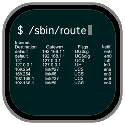
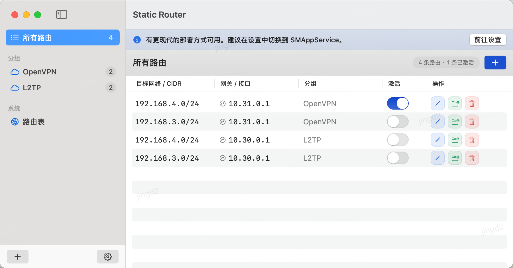
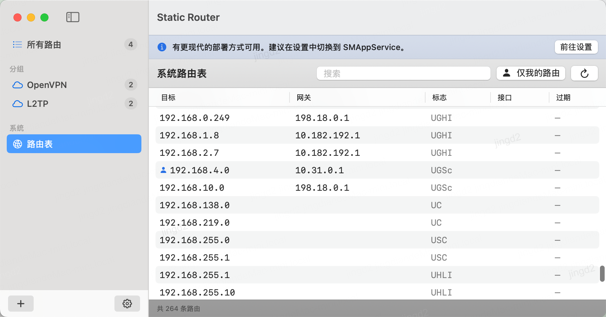
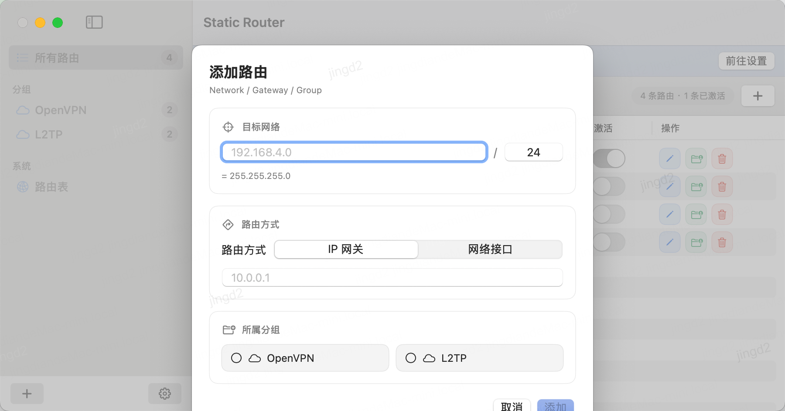
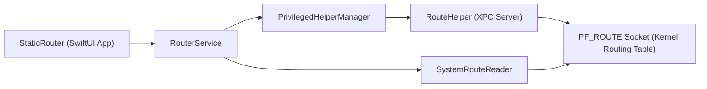

# StaticRouteHelper

<p align="center">
  
</p>

<p align="center">
  A macOS static route manager built with SwiftUI + privileged helper (XPC).
</p>

<p align="center">
  <a href="https://github.com/jdjingdian/StaticRouteHelper/releases"></a>
  <a href="https://github.com/jdjingdian/StaticRouteHelper/actions/workflows/release.yml"></a>
  
  <a href="./LICENSE"></a>
</p>

English | [简体中文](./README_CN.md)

## Table of Contents

- [Overview](#overview)
- [Feature Highlights](#feature-highlights)
- [Compatibility](#compatibility)
- [Download & Installation](#download--installation)
- [Usage Flow](#usage-flow)
- [Usage Screenshots](#usage-screenshots)
- [Architecture](#architecture)
- [Build from Source](#build-from-source)
- [Repository Layout](#repository-layout)
- [Security Notes & Limitations](#security-notes--limitations)
- [License](#license)

## Overview

StaticRouteHelper helps you manage IPv4 static routes on macOS with a desktop UI.

- Frontend: SwiftUI app (`StaticRouter`)
- Privileged operations: helper daemon (`RouteHelper`)
- IPC: typed XPC messages (`RouteWriteRequest` / `RouteWriteReply`)
- Route write path: PF_ROUTE socket (`RTM_ADD` / `RTM_DELETE`)

## Feature Highlights

- Add, edit, delete static routes
- Enable/disable routes individually
- Support both gateway modes:
  - IPv4 gateway address
  - Network interface (for example `utun3`, `en0`)
- System route table viewer:
  - Search
  - Refresh
  - "Show only my routes" filter
- Route groups (macOS 14+):
  - Create, rename, reorder, delete groups
  - Assign route to multiple groups
- Startup route-state calibration (sync saved state with actual system route table)
- Helper install status banner and guided recovery for SMAppService XPC failures
- English + Simplified Chinese localization

## Compatibility

| macOS | Data layer | UI mode | Helper install method |
| --- | --- | --- | --- |
| 12-13 | Core Data | Legacy navigation | SMJobBless |
| 14+ | SwiftData (with legacy migration) | NavigationSplitView + sidebar groups | SMAppService (recommended) or SMJobBless |

Current project version in Xcode settings: `2.2.3` (build `73`).

## Download & Installation

Pre-built binaries are available on [GitHub Releases](https://github.com/jdjingdian/StaticRouteHelper/releases).

1. Download and unzip the release package.
2. Move `Static Router.app` to your preferred location (for example `~/Applications/`).
3. Run the following command once in Terminal:

```bash
xattr -cr /path/to/Static\ Router.app
```

4. Launch the app, open **Settings -> General**, and install the helper.

Why step 3 is required:

- The project uses **ad-hoc code signing** (no paid Apple Developer certificate).
- The app is **not notarized**.
- Gatekeeper adds a quarantine flag to downloaded apps; `xattr -cr` removes it.

## Usage Flow

1. Open app and install helper from **Settings -> General**.
2. Add a route (`destination/prefix`, `gateway type`, `gateway`).
3. Toggle route activation in route list.
4. Open **System Route Table** to verify actual kernel routes.
5. Optionally group routes for organization (macOS 14+).

## Usage Screenshots

### 1) Route list with group organization and activation toggle



### 2) System route table with search and "Only My Routes" filter



### 3) Add route dialog (network, gateway mode, group assignment)



## Architecture



## Build from Source

Requirements:

- macOS 12+
- Xcode 15+ recommended

Build Debug:

```bash
xcodebuild \
  -project StaticRouteHelper.xcodeproj \
  -scheme "Static Router" \
  -configuration Debug \
  build
```

Build Release package (same direction as CI):

```bash
xcodebuild \
  -project StaticRouteHelper.xcodeproj \
  -scheme "Static Router" \
  -configuration Release \
  -derivedDataPath build/DerivedData

ditto -c -k --keepParent \
  "build/DerivedData/Build/Products/Release/Static Router.app" \
  "StaticRouteHelper-local.zip"
```

Useful scripts:

- `scripts/bump-version.sh <X.Y.Z>`: bump marketing/build version in `project.pbxproj`
- `scripts/validate-smappservice-health.sh [service_label]`: quick health check for SMAppService launchd job

## Repository Layout

- `StaticRouter/`: macOS app (SwiftUI)
- `RouteHelper/`: privileged helper daemon
- `Shared/`: shared XPC contracts/constants
- `.github/workflows/release.yml`: build/sign/package/release workflow
- `openspec/`: spec-driven change history

## Security Notes & Limitations

- Route operations require root privileges and a successfully installed helper.
- Current write/read implementation focuses on IPv4 routes.
- Misconfigured routes can affect host connectivity. Test carefully before applying broad destination ranges.
- If you use SMAppService on macOS 14+, system background-item approval may be required in System Settings.

## License

StaticRouteHelper is licensed under the [Apache License 2.0](./LICENSE).  
Copyright &copy; 2021, Derek Jing
