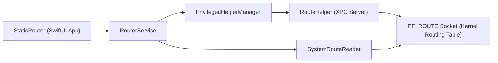

# StaticRouteHelper

<p align="center">
  
</p>

<p align="center">
  基于 SwiftUI + 特权 Helper（XPC）的 macOS 静态路由管理工具。
</p>

<p align="center">
  <a href="https://github.com/jdjingdian/StaticRouteHelper/releases"></a>
  <a href="https://github.com/jdjingdian/StaticRouteHelper/actions/workflows/release.yml"></a>
  
  <a href="./LICENSE"></a>
</p>

[English](./README.md) | 简体中文

## 目录

- [项目概览](#项目概览)
- [功能亮点](#功能亮点)
- [系统兼容性](#系统兼容性)
- [下载与安装](#下载与安装)
- [使用流程](#使用流程)
- [使用示意图](#使用示意图)
- [架构说明](#架构说明)
- [源码构建](#源码构建)
- [仓库结构](#仓库结构)
- [安全提示与限制](#安全提示与限制)
- [开源协议](#开源协议)

## 项目概览

StaticRouteHelper 用于在 macOS 上管理 IPv4 静态路由，提供桌面 UI 与受控提权能力。

- 前端应用：SwiftUI（`StaticRouter`）
- 特权操作：Helper 守护进程（`RouteHelper`）
- 通信方式：类型安全 XPC 消息（`RouteWriteRequest` / `RouteWriteReply`）
- 路由写入：PF_ROUTE socket（`RTM_ADD` / `RTM_DELETE`）

## 功能亮点

- 静态路由新增、编辑、删除
- 路由单条启用/停用
- 支持两种网关模式：
  - IPv4 网关地址
  - 网络接口名（例如 `utun3`、`en0`）
- 系统路由表查看：
  - 搜索
  - 刷新
  - 仅显示“我的路由”过滤
- 路由分组（macOS 14+）：
  - 新增、重命名、排序、删除分组
  - 单条路由可归属多个分组
- 启动时自动校准路由激活状态（持久化状态与系统真实路由对齐）
- SMAppService XPC 异常时提供引导与自动恢复流程
- 中英文本地化支持

## 系统兼容性

| macOS | 数据层 | 界面模式 | Helper 安装方式 |
| --- | --- | --- | --- |
| 12-13 | Core Data | 兼容模式导航 | SMJobBless |
| 14+ | SwiftData（含旧数据迁移） | NavigationSplitView + 分组侧边栏 | SMAppService（推荐）或 SMJobBless |

当前 Xcode 工程版本：`2.2.3`（build `73`）。

## 下载与安装

预编译包可在 [GitHub Releases](https://github.com/jdjingdian/StaticRouteHelper/releases) 下载。

1. 下载并解压发布包。
2. 将 `Static Router.app` 移动到你常用目录（例如 `~/Applications/`）。
3. 在终端执行一次以下命令：

```bash
xattr -cr /path/to/Static\ Router.app
```

4. 打开应用，在 **Settings -> General** 中安装 Helper。

为什么必须执行第 3 步：

- 项目当前使用 **Ad-hoc 签名**（未使用付费 Apple Developer 证书）。
- 应用 **未经过 Apple 公证（Notarization）**。
- 下载后 Gatekeeper 会添加隔离标记，`xattr -cr` 用于移除该标记。

## 使用流程

1. 启动应用，在 **Settings -> General** 安装 Helper。
2. 新建路由（目标网段/前缀、网关类型、网关值）。
3. 在路由列表中切换启用状态。
4. 打开 **System Route Table** 校验系统实际路由。
5. 如有需要，可通过分组组织规则（macOS 14+）。

## 使用示意图

### 1）路由列表：分组管理 + 单条激活开关


### 2）系统路由表：搜索 + 仅我的路由过滤


### 3）添加路由弹窗：目标网段、路由方式、分组归属


## 架构说明



## 源码构建

环境要求：

- macOS 12+
- 建议 Xcode 15+

Debug 构建：

```bash
xcodebuild \
  -project StaticRouteHelper.xcodeproj \
  -scheme "Static Router" \
  -configuration Debug \
  build
```

Release 打包（与 CI 方向一致）：

```bash
xcodebuild \
  -project StaticRouteHelper.xcodeproj \
  -scheme "Static Router" \
  -configuration Release \
  -derivedDataPath build/DerivedData

ditto -c -k --keepParent \
  "build/DerivedData/Build/Products/Release/Static Router.app" \
  "StaticRouteHelper-local.zip"
```

常用脚本：

- `scripts/bump-version.sh <X.Y.Z>`：更新 `project.pbxproj` 中的版本号与构建号
- `scripts/validate-smappservice-health.sh [service_label]`：快速检查 SMAppService 的 launchd 健康状态

## 仓库结构

- `StaticRouter/`：macOS 客户端（SwiftUI）
- `RouteHelper/`：特权 Helper 守护进程
- `Shared/`：共享常量与 XPC 消息定义
- `.github/workflows/release.yml`：构建/签名/打包/发布流水线
- `openspec/`：规格驱动的变更历史

## 安全提示与限制

- 路由操作依赖 root 权限与可用的 Helper。
- 当前路由读写能力聚焦 IPv4。
- 错误路由规则可能影响主机网络连通性，请先小范围验证。
- 在 macOS 14+ 使用 SMAppService 时，可能需要在系统设置中手动允许后台项目。

## 开源协议

StaticRouteHelper 基于 [Apache License 2.0](./LICENSE) 协议开源。  
Copyright &copy; 2021, Derek Jing
